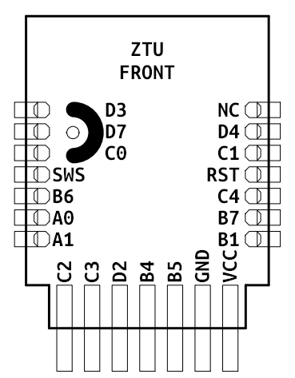
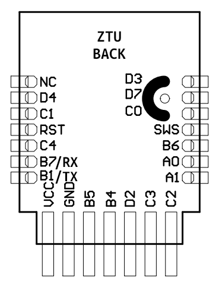
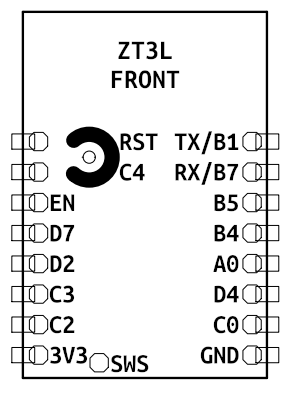
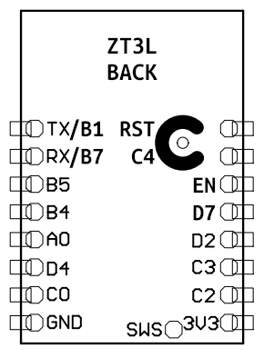
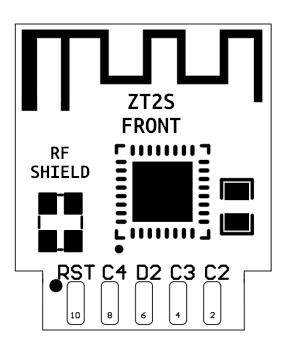
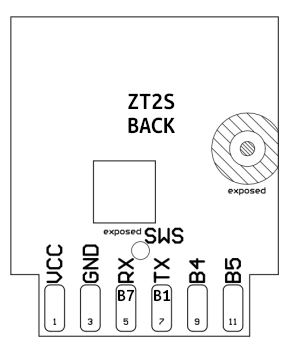
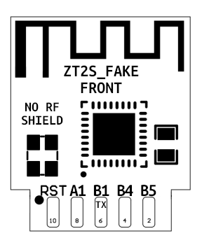
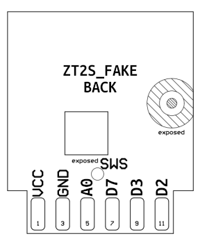

# Porting  

Follow this guide if [devices/supported.md](/docs/devices/supported.md) does not include your device.  
*Open the **Outline** (table of contents) from the top right.*  

### Steps
1. Check compatibility
2. **Obtain the board pinout**
3. Build and install the firmware

## Compatibility 

[ZT series]: https://developer.tuya.com/en/docs/iot/zt-series-module?id=Kaiuym8ctid7k
[ZS series]: https://developer.tuya.com/en/docs/iot/zs-series-module?id=Kaiuyljrfi0wv
[updating.md]: /docs/updating.md
[flashing_via_wire.md]: ./flashing_via_wire.md
[IEEE Address]: /docs/.images/screen_telink_mac.png

The firmware works on **Telink** (TLSR8258) and **Silabs** (EFR32MG21) microcontrollers.  
⤷ Check the **[IEEE Address]** or open the device to identify the MCU.  

|                   | Telink                                      | Silabs                                        |
|------------------:|---------------------------------------------|-----------------------------------------------|
| Devices           | Most Tuya devices after 2023                | Some Tuya remotes, switches. All SONOFF, IKEA |
| Tuya modules      | [ZT series]: ZTU, ZT2S, ZT3L                | [ZS series]: ZS3L                             |
| IEEE Address      | `0xa4c138xxxxxxxxxx`                        | Use 'MAC lookup' website                      |
| Stock ➡ Custom FW | OTA [updating.md] or [flashing_via_wire.md] | [flashing_via_wire_silabs.md]                 |

## Pinout

Every device has a different GPIO mapping.  
⤷ You must find **which pins the peripherals are connected to.**  

_Example: button on D2, LED on C2, switch on B5, relay on C4._  
After flashing, the pins can easily be changed in Z2M (but not in ZHA).

[labels]: https://github.com/romasku/tuya-zigbee-switch/issues/145#issuecomment-3303035527
[visible traces]: https://github.com/romasku/tuya-zigbee-switch/issues/146#issuecomment-3302750944
[lamp trick]: https://github.com/romasku/tuya-zigbee-switch/pull/188#issuecomment-3506916760
[solder points]: https://github.com/romasku/tuya-zigbee-switch/issues/183#issuecomment-3491147138
[follow pattern]: https://github.com/romasku/tuya-zigbee-switch/issues/181#:~:text=Pictures-,Configs,-We%20obtained%20the

### Obtaining

There are multiple safe ways to obtain the pinout:
- **Look for clues on the PCB**: [labels], [solder points] and [visible traces] ([lamp trick]) 
- **Test continuity** (resistance) with a multimeter
- **Try each pin** until something works (brute force)
- Truncate the pinout of a higher-gang model ([follow pattern])
- Extract pinout from original firmware (memory dump)
- Ask someone else to do it 🙂

> [!CAUTION]  
> Tuya devices do not have galvanic isolation! *The DC circuit may operate at 230-235V.*  
> ***Do not plug a dissasembled device into mains power!*** 

### Tuya modules

There are 4 (A,B,C,D) × 8 (0-7) = 32 GPIO pins on the TLSR8258 ?  
⤷ Here are the **exposed pins** for each module (usable for peripherals):

[`ZTU`]: https://developer.tuya.com/en/docs/iot/ztu-module-datasheet?id=Ka45nl4ywgabp
[`ZT3L`]: https://developer.tuya.com/en/docs/iot/zt3l-module-datasheet?id=Ka438n1j8nuvu
[`ZT2S`]: https://developer.tuya.com/en/docs/iot/zt2s-module-datasheet?id=Kas9gdtath9p0
[`ZT2Sᶠ`]: https://github.com/romasku/tuya-zigbee-switch/issues/6#issuecomment-2568045792

| Module        | Pins |      |      |      |      |      |      |      |      |      |      |      |      |      |      |      |
|--------------:|------|------|------|------|------|------|------|------|------|------|------|------|------|------|------|------|
| **[`ZTU`]**   | `A0` | `A1` | `B1` | `B4` | `B5` | `B6` | `B7` | `C0` | `C1` | `C2` | `C3` | `C4` | `D2` | `D3` | `D4` | `D7` |
| **[`ZT3L`]**  | `A0` |      | `B1` | `B4` | `B5` |      | `B7` | `C0` |      | `C2` | `C3` | `C4` | `D2` |      | `D4` | `D7` |
| **[`ZT2S`]**  |      |      | `B1` | `B4` | `B5` |      | `B7` |      |      | `C2` | `C3` | `C4` | `D2` |      |      |      |
| **[`ZT2Sᶠ`]** | `A0` | `A1` | `B1` | `B4` | `B5` |      |      |      |      |      |      |      | `D2` | `D3` | `D7` |      |

If you want to **guess the pinout** after flashing (brute-force):  
⤷ **Assign the unused pins**: `A2`, `A3`, `A4`, `A5`, `A6`, `A7`, `B0`, `B2`, `B3`, `C5`, `C6`, `C7`, `D0`, `D1`, `D5`, `D6`

#### Diagrams

### Config string

The next step is filling the device config string for the database entry.

**Format**:  
⤷ `<new manufacturer>;<new model>;<pin setup 1>;<pin setup 2>;...;<pin setup n>;`  

**Minimum example** (1-gang module with LED on `A2`, switch on `A3` and relay on `A4`):  
⤷ `ljasd9as;TS0001-ABC;LA2;SA3u;RA4;`  

**Complex example** (2-gang switch with bi-stable relays):  
⤷ `osap2dsa;TS0002-ABC;BC3u;LC2i;SB5u;RD2D4;IA0;SB4u;RD3B1;IA1;M;i43533;`

| Ch      | Peripheral    | Function                                                                            |
|--------:|---------------|-------------------------------------------------------------------------------------|
| **`B`** | Reset button  | • Puts device in pairing                                                            |
| **`L`** | Network led   | • Blinks while pairing   • Is the backlight sometimes                            |
| **`S`** | Switch        | • User input   • Tactile, touch or external button (wire)   • Spam to put in pairing mode |
| **`R`** | Relay         | • Non-latching: `RC1` - 1 pin - toggle   • Latching: `RC2C3` - 2 pins - on, off  |                                               |
| **`I`** | Indicator LED | • 1 per relay, follows state   • Blinks while pairing if there is no network led |

For buttons (`B`) and switches (`S`), the next character determines the pull-up/down resistor:  
⤷ **`u`: up 10K**, `U`: up 1M, `d`: down 100K, `f`: float  

99% of the time, pressing the button bridges the GPIO pin to Ground (active low).  
⤷ So we need a pull-up resistor `u` to hold it at VCC (high) while not pressed.

For LEDs, add `i` to invert the state.

Additional options: 
| Format       | Option     | Function                                                                  |
|-------------:|------------|---------------------------------------------------------------------------|
| **`i00000`** | Image type | • Change OTA image_type (migrate to another build)                        |
| **`M`**      | Momentary  | • Defaults buttons to momentary mode (for devices with built-in switches) |

*In Z2M, update the config with different pins until the device works properly.*   

## Build and install

[`device_db.yaml`]: /device_db.yaml
[device_db_explained.md]: ./device_db_explained.md
[building.md]: ./building.md

1. Fork the repository and add an entry to [`device_db.yaml`]. *Remove other devices to build faster.*   
Follow [device_db_explained.md] and validate with `device_db.schema.json` (e.g. YAML VSCode extension).  

2. Visit GitHub Actions on your fork (web) and run `build.yml`. More info: [building.md]

3. Follow [updating.md] with the index and converters from your branch.  
Alternatively, try [flashing_via_wire.md].

Thank you for trying this firmware!  